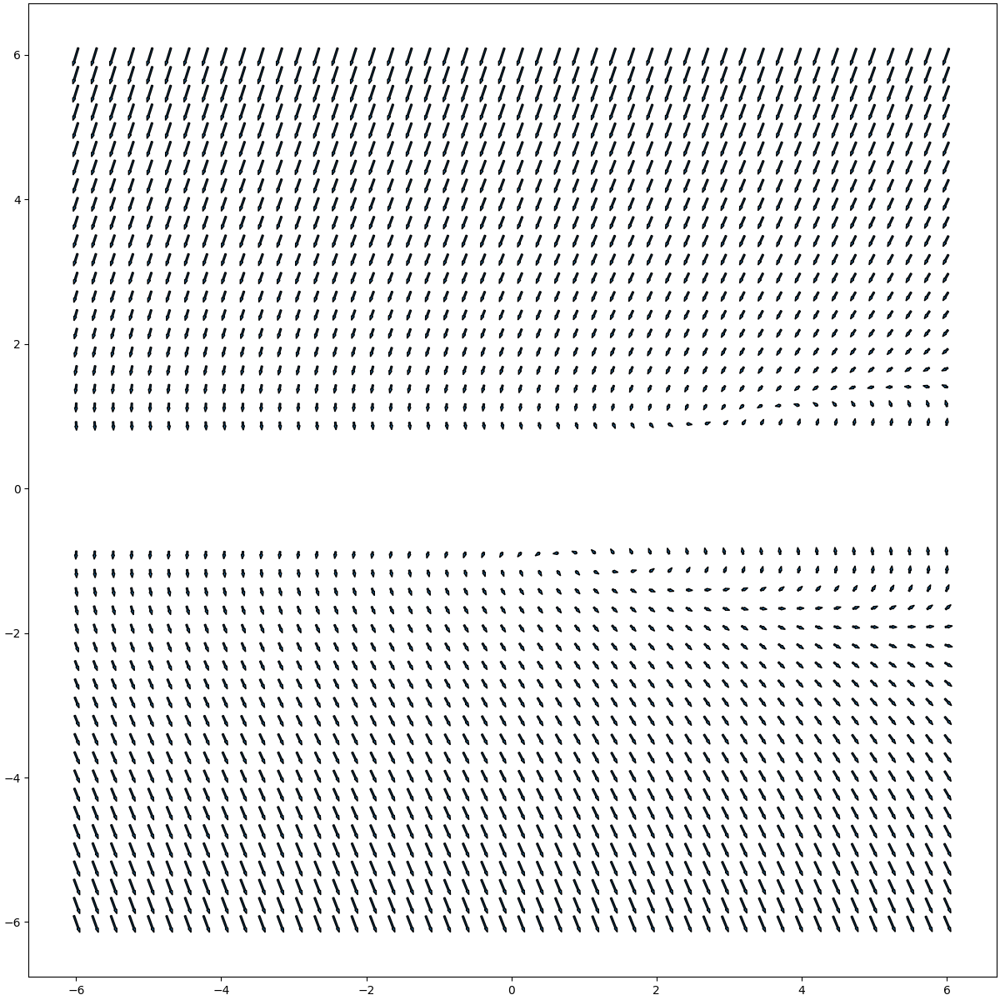
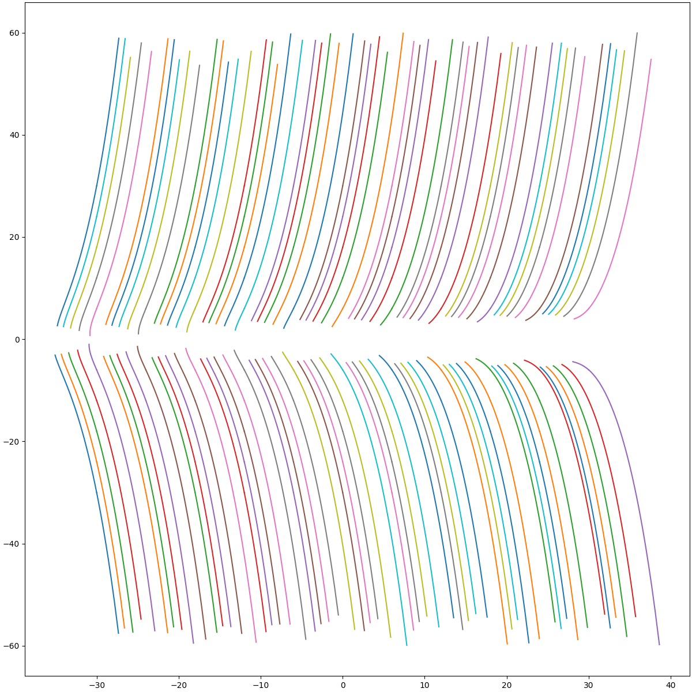

# Лабораторная работа №3.

Построение фазовых траекторий системы.

Система:
```math
\begin{cases}x' = -y \ln(2y^2 - 1)\\ y'= x - y - 2y^2\end{cases}
```

Исходный код, а также корректный рендер README находится в [этом репозитории на Github](https://github.com/FB1-ITMO-CT/sem03-diff-eq-lab-003).

Автор: Бородулин Фёдор, M3238

## Аналитическое исследование точек покоя

Положения равновесия определяются из условий $x' = 0$ и $y' = 0$:
1. Условие $x' = 0$: $-y \ln(2y^2 - 1) = 0 \Rightarrow y = 0 \vee \ln(2y^2 - 1) = 0$
   1. Случай $y = 0$:
      $y' = x - 0 - 2 \cdot 0^2 = x = 0 \Rightarrow x = 0$
      Точка $(0, 0)$.
      Не подходит, так как $\ln(2y^2 - 1) = \ln(-1)$ не определено в вещественных числах.
   
   2. Случай $\ln(2y^2 - 1) = 0$:
      $2y^2 - 1 = 1 \Rightarrow 2y^2 = 2 \Rightarrow y^2 = 1 \Rightarrow y = \pm 1$
   
      1. При $y = 1$: $y' = x - 1 - 2 \cdot 1^2 = x - 3 = 0 \Rightarrow x = 3$
         Точка $(3, 1)$.
      2. При $y = -1$: $y' = x - (-1) - 2 \cdot (-1)^2 = x + 1 - 2 = x - 1 = 0 \Rightarrow x = 1$
         Точка $(1, -1)$.
   
      Обе точки удовлетворяют условию $2y^2 - 1 = 1 > 0$.

Итого, положения равновесия: $(3, 1)$ и $(1, -1)$.

## Линеаризация системы

Частные производные:
- $\frac{\partial f}{\partial x} = 0$
- $\frac{\partial f}{\partial y} = -\left[ \ln(2y^2 - 1) + y \cdot \frac{4y}{2y^2 - 1} \right] = -\ln(2y^2 - 1) - \frac{4y^2}{2y^2 - 1}$
- $\frac{\partial g}{\partial x} = 1$
- $\frac{\partial g}{\partial y} = -1 - 4y$

Итого, матрица Якоби системы:
```math
J(x, y) = \begin{pmatrix} 0 & -\ln(2y^2 - 1) - \dfrac{4y^2}{2y^2 - 1} \\\ 1 & -1 - 4y \end{pmatrix}
```

## Анализ равновесия

### Точка $(3, 1)$

Матрица Якоби:
```math
J(3, 1) = \begin{pmatrix}0 & -4\\ 1 & -5\end{pmatrix}
```

Характеристическое уравнение:
```math
\det(J - \lambda I) = \begin{vmatrix} -\lambda & -4 \\\ 1 & -5 - \lambda \end{vmatrix} = \lambda(5 + \lambda) + 4 = \lambda^2 + 5\lambda + 4 = 0
```

Корни: $\lambda_{1,2} = \frac{-5 \pm \sqrt{25 - 16}}{2} = \frac{-5 \pm 3}{2} \Rightarrow \lambda_1 = -1, \quad \lambda_2 = -4$

Оба собственных значения действительные и отрицательные, следовательно, $(3, 1)$ — устойчивый узел.

### Точка $(1, -1)$

Матрица Якоби:
```math
J(1, -1) = \begin{pmatrix}0 & -4\\ 1 & 3\end{pmatrix}
```

Характеристическое уравнение:
```math
\det(J - \lambda I) = \begin{vmatrix} -\lambda & -4 \\\ 1 & 3 - \lambda \end{vmatrix} = -\lambda(3 - \lambda) + 4 = \lambda^2 - 3\lambda + 4 = 0
```

Дискриминант: $D = 9 - 16 = -7 < 0$, корни: $\lambda_{1,2} = \frac{3 \pm i\sqrt{7}}{2} = 1.5 \pm i \frac{\sqrt{7}}{2}$

Собственные значения комплексные, с положительной действительной частью, следовательно, $(1, -1)$ — неустойчивый фокус.

## Фазовые траектории



Карта направлений производной. Команда: `run -figsize 12:12 -out "./examples/direction_map.png" dir_map -6 -6 6 6 48`



Линии графика в разных точках, полученные численным методом. Команда: `run -figsize 12:12 -out "./examples/trajectories.png" traj_map -30 -30 30 30 11 0.1 100`

## Программная часть

### Исходный код

Файлы исходного кода на языке Python находятся в директории `./src`.

### Сборка и запуск проекта

Для работы с зависимостями используется инструмент [uv](https://github.com/astral-sh/uv):

- Создайте виртуальное окружение Python с необходимой для проекта версией интерпретатора 3.14: `uv venv --python 3.14 .venv`.

- Включите созданное окружение `./.venv/Scripts/activate` и синхронизируйте зависимости `uv sync --active`.

- Теперь доступен CLI интерфейс проекта `run`, вызывающий функцию `src.main:main`.
  Можно запустить `run --help` для получения справки по аргументам командной строки.

## Лицензия :)

Copyright 2025 Borodulin Fedor

Licensed under the Apache License, Version 2.0 (the "License");
you may not use this file, this project source code and examples except
in compliance with the License. You may obtain a copy of the License at

    http://www.apache.org/licenses/LICENSE-2.0

Unless required by applicable law or agreed to in writing, software
distributed under the License is distributed on an "AS IS" BASIS,
WITHOUT WARRANTIES OR CONDITIONS OF ANY KIND, either express or implied.
See the License for the specific language governing permissions and
limitations under the License.

